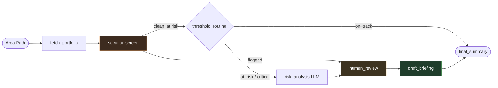

# ADO Portfolio Risk Agent


An ADK 2.0 workflow that triages budget risk across Azure DevOps Epics for a DevOps portfolio. It pulls hours consumption through a custom MCP server, screens every piece of text for PII and prompt-injection attempts before it ever reaches a language model, classifies risk against fixed business thresholds, and pauses for human approval only when it actually matters — closing with an executive-ready briefing.

Built for the **5-Day AI Agents: Intensive Vibe Coding Course with Google** (Kaggle x Google), *Agents for Business* track.

---

## Contents

- [Why this exists](#why-this-exists)
- [Architecture](#architecture)
- [What's in this repo](#whats-in-this-repo)
- [Running it](#running-it)
- [Course concepts applied](#course-concepts-applied)

---

## Why this exists

Portfolio and delivery leads spend real time each week manually checking whether hours logged against Epics in Azure DevOps are still tracking to budget. It's repetitive, easy to defer, and by the time a cost overrun is noticed it's often too late to correct cheaply. This agent automates the first pass of that review — and treats the data it reads as untrusted by default, since work item titles and descriptions are free text anyone on a team can edit.

## Architecture



<details>
<summary><strong>Node-by-node breakdown</strong></summary>

1. **`fetch_portfolio`** — pulls Epic status for a given Area Path through the `ado-devops-portfolio` MCP server, including hours rolled up from child Tasks (Original Estimate / Completed Work / Remaining Work).
2. **`security_screen`** — redacts PII (emails, tokens, card numbers) and flags prompt-injection attempts in Epic titles/descriptions, in plain deterministic code, before anything reaches an LLM.
3. **`threshold_routing`** — risk bands (`on_track` / `at_risk` / `critical`) are computed in code, not left to the model to interpret. Flagged Epics are routed straight to human review and never reach the LLM, regardless of their consumption level.
4. **`risk_analysis`** (LlmAgent) — drafts the reasoning behind each at-risk or critical Epic.
5. **`human_review`** — pauses the workflow and requires an explicit approve/reject decision before anything gets escalated.
6. **`draft_briefing`** — an Agent Skill turns the approved findings into a short, jargon-free executive briefing. Security incidents get their own report section, separate from ordinary budget alerts.

</details>

Full design rationale in [`docs/ARCHITECTURE.md`](docs/ARCHITECTURE.md).

## What's in this repo

| Path | Purpose |
|---|---|
| `app/` | ADK graph implementation |
| `mcp_server/ado_devops_mcp.py` | MCP server exposing read-only Azure DevOps tools (WIQL + workitemsbatch), with task-level hour rollups |
| `security/redaction.py` | PII redaction and prompt-injection detection |
| `tests/` | Outcome-based tests (security, config thresholds, integration) |
| `.agents/skills/ado-risk-briefing/SKILL.md` | Agent Skill used by `draft_briefing` |
| `.agents/CONTEXT.md` | Security rules and business thresholds, loaded as persistent agent context |
| `docs/ARCHITECTURE.md` | Architecture and design decisions |

## Running it

<details>
<summary><strong>Setup steps</strong></summary>

```bash
pip install -e .
cp .env.example .env   # fill in your Gemini API key and Azure DevOps PAT
pytest tests/test_security.py -v
```

Open the project in an ADK-compatible environment (Google Antigravity or the `adk` CLI) and run:

```bash
adk web
```

to try the graph in the Playground.

</details>

## Course concepts applied

| Concept | Where it lives |
|---|---|
| ✅ Multi-node ADK 2.0 graph workflow | `app/agent.py` |
| ✅ Custom MCP server | `mcp_server/ado_devops_mcp.py` |
| ✅ Agent Skills | `.agents/skills/ado-risk-briefing/` |
| ✅ Security & evaluation | `security/redaction.py`, `tests/test_security.py`, human-in-the-loop gate |

See `docs/ARCHITECTURE.md` for how each concept shows up in the running system.
