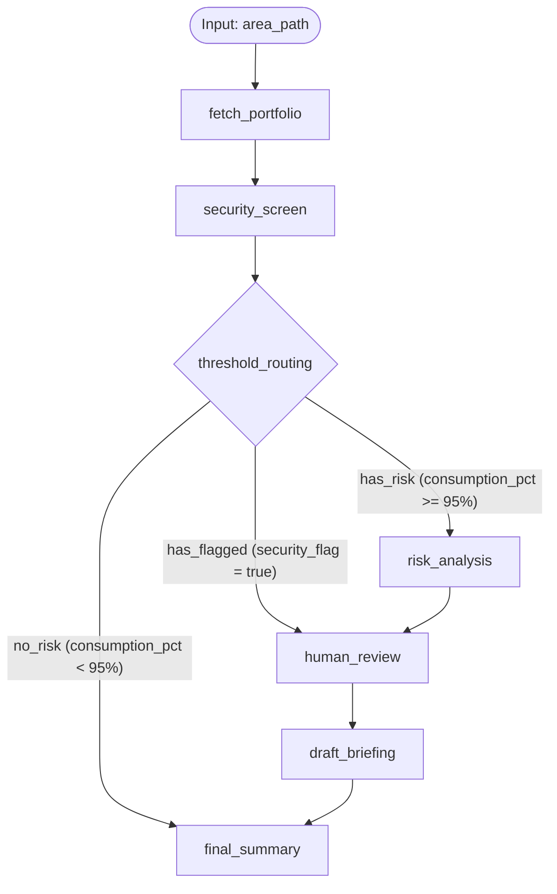

# Architecture - ADO Portfolio Risk Agent

## Business Problem

DevOps Tribe Leads (e.g., Payment Methods / Interdin-Diners) manually audit hours consumed against budgets and schedules across every Azure DevOps Epic. This manual process is repetitive, error-prone, and fails to scale with a large number of concurrent active Epics. Furthermore, any automation that directly reads unstructured user input (such as ticket titles or descriptions) is vulnerable to exposure of personally identifiable information (PII) or intentional prompt injection designed to bypass system controls.

## Solution

The ADO Portfolio Risk Agent automates this triage process using a workflow graph. It fetches the active portfolio metrics, automatically routes items based on risk and security checks, and only requests manual human intervention for Epics identified as high-risk or containing suspicious content.

## Concept Mapping

| Concept | Application in Codebase |
|---|---|
| Graph Workflow (Multi-node) | Located in [app/agent.py](../app/agent.py): orchestrates execution through `fetch_portfolio` -> `security_screen` -> conditional routing -> `risk_analysis` -> `human_review` -> `draft_briefing` -> `final_summary`. |
| MCP Servers | Located in [mcp_server/ado_devops_mcp.py](../mcp_server/ado_devops_mcp.py): exposes the `get_portfolio_status` and `get_epic_detail` tools, authenticated with Azure DevOps Basic Authentication (PAT). |
| Agent Skills | Located in [.agents/skills/ado-risk-briefing/SKILL.md](../.agents/skills/ado-risk-briefing/SKILL.md): loaded dynamically to generate functional, non-technical executive briefs for approved risk alerts. |
| Security & Validation | Located in [security/redaction.py](../security/redaction.py): handles PII redaction and prompt injection detection with unit tests. |
| Staging & Production Deployment | Not implemented in this submission; deploying to Agent Runtime is a natural next step. |

## Business Value

This agent addresses the operational challenges of DevOps portfolio management (hours consumed vs. budget) by significantly reducing the manual auditing overhead for Tribe Leads. Key benefits include:
- Reduced manual triage time by auto-approving on-track items.
- Early detection of cost overruns and deviations.
- Upstream security sanitization that safeguards against data manipulation and sensitive data leaks.

## Design Decisions

- **Read-Only MCP Interface**: The MCP server is intentionally restricted to read-only operations. The agent should only inform and suggest, never write or close Epics automatically in Azure DevOps.
- **Deterministic Risk Thresholds**: Risk categorization thresholds live directly in code ([app/config.py](../app/config.py)) rather than inside LLM system prompts to prevent hallucination and prompt-based manipulation.
- **Sanitization Before Processing**: The security screen runs upstream of any LLM node, ensuring that all unstructured text is sanitized and checked before it can influence agent logic.
- **Mandatory Human-in-the-Loop**: High-risk or flagged Epics require explicit human approval to issue an executive alert, ensuring that authority remains with the DevOps lead.
